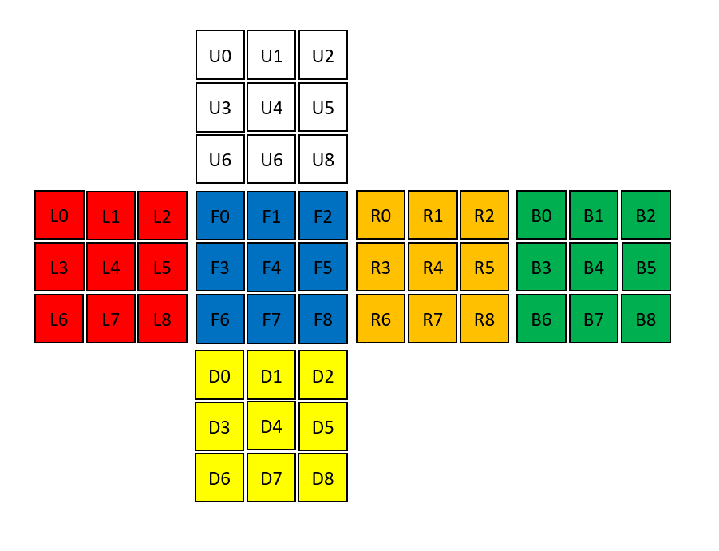

# Real-time Rubik's Cube blindfolded solver using Raspberry Pi and OpenCV
This is the 2nd version of Rubik’s cube tool made for solving in blindfolded. The 1st version was developed by javascript, you can see the project https://github.com/mn-banjar/RubiksCubeBlindfolded

Unlike the previous, this version uses OpenCV library to detect the colors and enter the inputs, and provides better visualization technique. 


The biggest issue in this newest version is the visualization of outputs, the sequence items are displayed on the drawn cube 1 at a time. Since the cube is a 3D shape, it is difficult to display all the sides at the same time. See the results on my YouTube channel https://youtu.be/dEIOcQjnwAI

I’m using a stickerless cube, this needs a custom recognition and most open source codes are not supported. I used this open source developed by Kim Koomen which specifies fixed areas on the camera frame to detect the correct colors of the cube faces https://github.com/kkoomen/qbr 


## Components needed
* Raspberry Pi
* webcam 

or you can use your laptop


## Dependencies
* Python 3
* numpy library
* OpenCV library
```$ sudo apt-get install python3-opencv```
* RubiksBlindfolded package
```$ pip3 install RubiksBlindfolded```


## Preparations
You need to calibrate the color detection as a pre step. The HSV color codes are varying due to the lighting, the camera quality and resolution, and the cube colors itself. In my case, I combine white and yellow lights to get correct results.

Update ```get_color_name(hsv)``` function on colordetection.py 


The original source code uses kociemba package to solve the cube, it solves by finding the reverse steps of any scramble. In this version, I used my own solving package named RubiksBlindfolded that published on PyPI. See the description to know how to use it https://pypi.org/project/RubiksBlindfolded/ 


## Usage


After installing all the dependencies and setting your camera, this is the time to run blindfolded.py script


First, you need to scan your cube in the correct orientations. This is the cube structure, the order of scanning the faces is not important. Notice that these are the default colors of the cube faces, you can change them by updating the ```notation``` dictionary on blindfolded.py script

To make the scan press ``` space```  key to save the view and ``` ESC```  key after finishing


Second, you can see the solution sequences on the console, and the parity check to tell you if you need to apply the parity algorithm or not


Third, a new frame will be generated that displays 2 drawn cubes for edge sequence and corner sequence. You can use ``` left```  and ``` right```  arrow keys for switching between the sequence items, and ``` up```  and ``` down```  arrow keys for switching between the edge and corner. the light gray color represents the current sequence.

You can see the colors of the current buffer that are changing dynamically by arrow keys. Gray colors represent the target cubie, and pink color represents the swapping face


